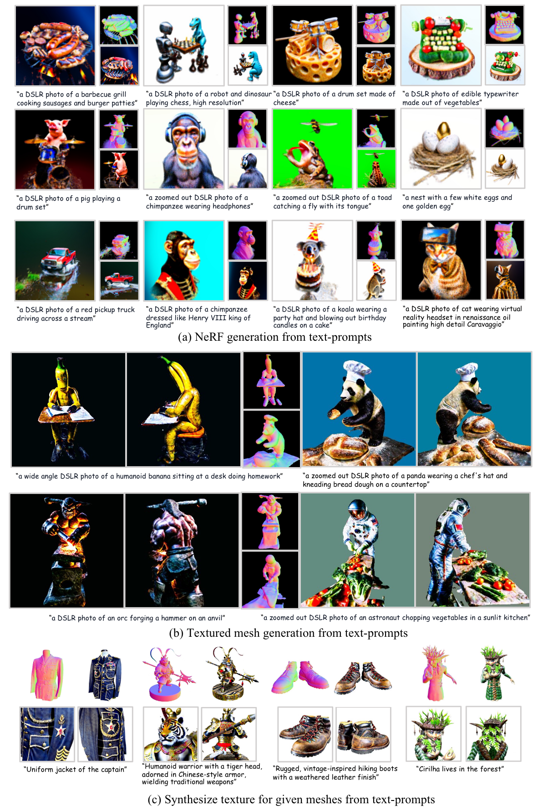

# <p align="center"> Text-to-3D with Classifier Score Distillation

#####  <p align="center"> [Xin Yu](https://scholar.google.com/citations?user=JX8kSoEAAAAJ&hl=zh-CN), [Yuan-Chen Guo](https://scholar.google.com/citations?user=b7ZJV9oAAAAJ&hl=zh-CN), [Yangguang Li](https://yg256li.github.io/), [Ding Liang](https://scholar.google.com/citations?user=Dqjnn0gAAAAJ&hl=zh-CN), [Song-Hai Zhang](https://scholar.google.com/citations?user=AWtV-EQAAAAJ&hl=en), [Xiaojuan Qi](https://scholar.google.com/citations?user=bGn0uacAAAAJ&hl=en)

### <p align="center"> [Project Page](https://xinyu-andy.github.io/Classifier-Score-Distillation/) | [Paper](https://arxiv.org/abs/2310.19415)

## Abstract
Text-to-3D generation has made remarkable progress recently, particularly with methods based on Score Distillation Sampling (SDS) that leverages pre-trained 2D diffusion models. While the usage of classifier-free guidance is well acknowledged to be crucial for successful optimization, it is considered an auxiliary trick rather than the most essential component. In this paper, we re-evaluate the role of classifier-free guidance in score distillation and discover a surprising finding: the guidance alone is enough for effective text-to-3D generation tasks. We name this method Classifier Score Distillation (CSD), which can be interpreted as using an implicit classification model for generation. This new perspective reveals new insights for understanding existing techniques. We validate the effectiveness of CSD across a variety of text-to-3D tasks including shape generation, texture synthesis, and shape editing, achieving results superior to those of state-of-the-art methods.



https://github.com/CVMI-Lab/Classifier-Score-Distillation/assets/60741299/500dd17b-f494-442c-ac6f-b57ccb83cd5d

https://github.com/CVMI-Lab/Classifier-Score-Distillation/assets/60741299/70f8bdee-b5ed-4da0-8658-266443a7e2be

https://github.com/CVMI-Lab/Classifier-Score-Distillation/assets/60741299/c59fdd56-4743-4e33-948f-c47338994f75

https://github.com/CVMI-Lab/Classifier-Score-Distillation/assets/60741299/1fc595d9-8374-4831-9a6a-49ed48e0b38a

https://github.com/CVMI-Lab/Classifier-Score-Distillation/assets/60741299/edad7bb4-ec75-4278-9cee-cf38a94dae60

https://github.com/CVMI-Lab/Classifier-Score-Distillation/assets/60741299/17e8010f-8281-4f99-a80a-e07599905759


## Installation
The codebase is built upon the Threestudio framework. Please follow the installation instructions available at the [Threestudio](https://github.com/threestudio-project/threestudio) repository for environment setup and basic usage.
## Running the Code
To run the Classifier Score Distillation (CSD) code, simply execute the provided `run.sh` script. 
For prompts that do not contain clear directional objects, it is recommended to use the alternative configuration by running `run2.sh`, which is tailored for such scenarios.

## Addressing the Janus Problem
While this work does not directly solve the Janus problem, as it primarily arises from the lack of 3D-aware capabilities in diffusion guidance, we offer a workaround. By combining [multi-view diffusion guidance](https://github.com/bytedance/MVDream-threestudio) with our CSD, it is possible to address this issue. For this, please refer to the code in the 'CSD-MVDream' branch.

## Credits
This codebase is built upon the [Threestudio](https://github.com/threestudio-project/threestudio). Thanks to the authors for their great codebase and contribution to the community.

## Citation
Please consider :grimacing: staring this repository and citing our work if you feel this repository useful.

```
@article{yu2023text,
  title={Text-to-3d with classifier score distillation},
  author={Yu, Xin and Guo, Yuan-Chen and Li, Yangguang and Liang, Ding and Zhang, Song-Hai and Qi, Xiaojuan},
  journal={arXiv preprint arXiv:2310.19415},
  year={2023}
}
```

## Contact
If you have any questions, you can email me (yuxin27g@gmail.com).


